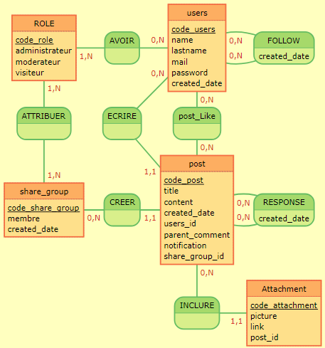

ROLE: code_role, administrateur, moderateur, visiteur
AVOIR, 0N users, 1N role
users: code_users, name, lastname, mail, password, created_date
FOLLOW, 0N users, 0N users : created_date

ATTRIBUER, 1N role, 1N share_group 
ECRIRE, 0N users, 11 post
postLike,0N post, 0N users
:

share_group: code_share_group, membre, created_date
CREER, 11 post, 0N share_group 
post: code_post, title, content, created_date, users_id, parent_post, notification, share_group_id
RESPONSE, 0N post, 0N post : created_date

:
:
INCLURE, 0N post, 11 Attachment
Attachment:code_attachment, picture, link, post_id

